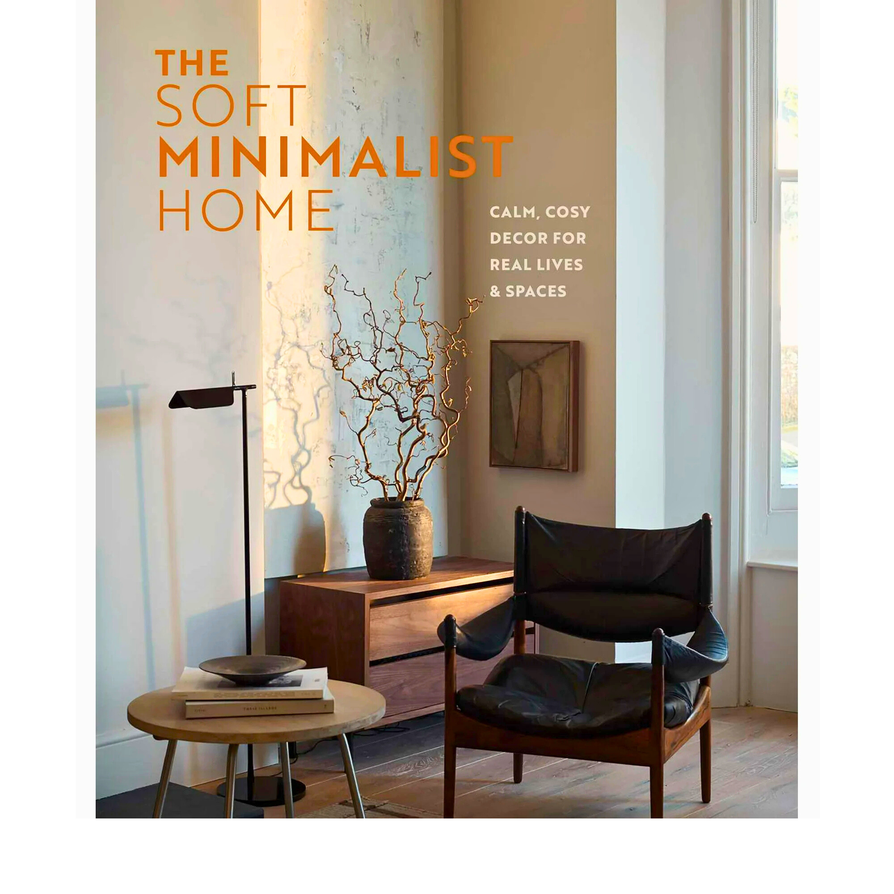

# Minimalist Home Decor  

## Introduction  
Minimalism in home décor focuses on simplicity, functionality, and calming design. A minimalist home often combines clean lines, neutral colors, and carefully chosen furniture to create a sense of space and peace.  

### Why Choose Minimalist Decor?  
Minimalist design has become popular because it emphasizes living with fewer, but more meaningful, objects. This approach creates a calm environment that feels open and stress-free.  

---

## Key Elements of Minimalist Design  
- Neutral color palettes (white, beige, gray)  
- Natural materials (wood, stone, linen)  
- Functional and multipurpose furniture  
- Decluttered spaces  

---

## Steps to Create a Minimalist Living Room  
1. Declutter unnecessary items.  
2. Choose simple and functional furniture.  
3. Use natural light as much as possible.  
4. Add one or two statement decor pieces.  

---

## Helpful Resources  
- [Apartment Therapy: Minimalism](https://www.apartmenttherapy.com)  
- [Becoming Minimalist](https://www.becomingminimalist.com)  
- [Minimalist Home Blog](https://www.theminimalists.com/home/)  

---

## Example Decor Image  
Here’s an example of a minimalist interior design:  

  
